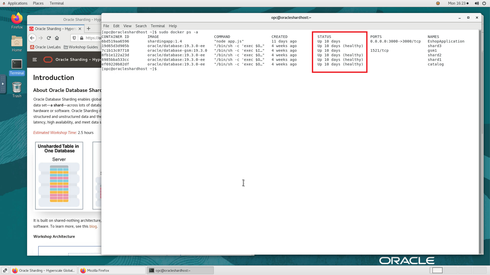

# Initialize Environment

## Introduction

In this lab we will review and startup all components required to successfully run this workshop.

*Estimated Lab Time:* 10 Minutes.

Watch the video for a quick walk through of the Initialize Environment lab.

[](youtube:e3EXx3BMhec)

### Objectives
- Initialize the workshop environment.

### Prerequisites
This lab assumes you have:
- A Free Tier, Paid or LiveLabs Oracle Cloud account
- You have completed:
    - Lab: Prepare Setup (*Free-tier* and *Paid Tenants* only)
    - Lab: Environment Setup

## Task 1: Validate That Required Processes are Up and Running.
1. Now with access to your remote desktop session, proceed as indicated below to validate your environment before you start executing the subsequent labs. The following Processes should be up and running:

    - Oracle Sharding GSM  Container
    - Oracle Sharding Catalog container
    - Three Oracle shard Database containers

2. Open a terminal session and proceed as indicated below to validate the services.

    - Oracle Sharding container Details

        ```
        <copy>
        sudo docker ps -a
        </copy>
        ```
        

    - If a container is stopped and not in running state then try to restart it by using the below docker command.

        ```
        <copy>
        sudo docker stop <container ID/NAME>
        </copy>
        <copy>
        sudo docker start <container ID/NAME>
        </copy>
        ```
    

You may now proceed to the next lab.

## Acknowledgements
* **Authors** - Richard Delval
* **Contributors** - Param Saini,Jyoti Verma, Pankaj Chandiramani, Shefali Bhargava, Virginia Beecher
* **Last Updated By/Date** - 
