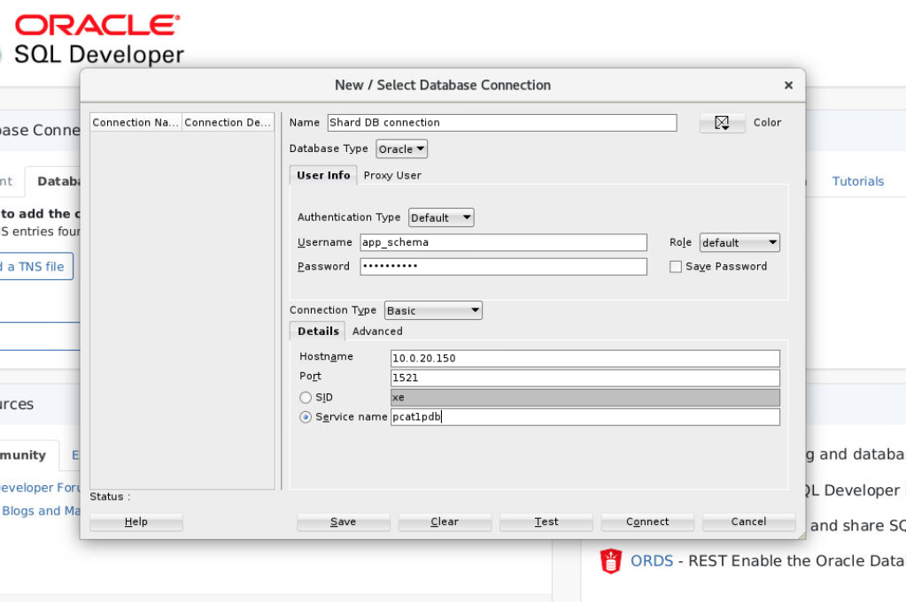

# Prepare the Sharded DB

## Introduction

Now, we have 

*Estimated Lab Time:* 60 minutes.

Watch the video below for a quick walk through of the lab.
[Deployment the Sharded Database](videohub:1_m1amf8pg)

### Objectives

In this lab, you will connect to the sharded DB and create a sharded table to hold our JSON data.

### Prerequisites
This lab assumes you have:
- An Oracle Cloud account
- You have completed:
    - Lab: Prepare Setup (*Free-tier* and *Paid Tenants* only)
    - Lab: Environment Setup
    - Lab: Initialize Environment

## Task 1: Connect to the DB with SQL Developer

In the remote desktop session, open up SQL Developer by choosing **Applications** from the top menu, then select **Programming** and then select the **SQL Developer** icon.

First we need to create a DB connection to the Catalog DB. 




1. Click the green Plus sign in the upper left of SQL Developer to add a new Connection.
2. A New Connection Window will appear as in the Screenshot above
3. Provide a name for the new connection such as 'Shard DB Catalog'
4. The Shard user is named 'app_schema' with a password of 'app_schema'
5. For the hostname use '10.0.20.150' This is the internal IP Address of the Catalog container. Port is 1521.
6. For the Service name use 'pcat1pdb'

A new connection will be created and we are now connected to the shard catalog as the user app_schema. From here we will proceed to use SQL Developer to create the necessary schemas.


## Task 2: Create the Sharded JSON table

While still connected to the Catalog DB in SQL Developer, goto the open file dialog by clicking on File->Open in SQL Developer. Then in Home, open up the folder 'sqlscripts' and select the file 'createshardtable.sql'

The script below should open up in SQL Developer:

```
/* Enable shard DDL */
ALTER SESSION ENABLE SHARD DDL;

/* Create a tablespace set */
CREATE TABLESPACE SET TSP_SET_1 USING TEMPLATE
 (datafile size 100m autoextend on next 10M maxsize unlimited
 extent management local segment space management auto);

/* Create the sharded table */
CREATE SHARDED TABLE CUSTOMERS
(
"ID" VARCHAR2(255) NOT NULL,
"CUSTPROFILE" JSON,
PRIMARY KEY (ID)
)
TABLESPACE SET TSP_SET_1
PARTITION BY CONSISTENT HASH (ID) PARTITIONS AUTO;
```
The script will create a tablespace set and then create a sharded table to hold our JSON. Aside from the JSON column itself, we have added another column to use as the shard key and set this as the Primary Key.

Run the script now in SQL Developer by choosing 'Run Script' - the second icon from the left in the SQL Develeoper tab. 

Expand the Results window at the bottom if necessary to see that the script executed successfully.


## Task 3: Seed the JSON Table

1. Switch to the browser tab connecting to the remote desktop session for catalog database host (*cata*)


2. Switch to the GSM environment.

    ```
    [oracle@cata ~]$ <copy>. ./gsm.sh</copy>
    [oracle@cata ~]$
    ```

3. Launch `GDSCTL` to configure the sharded database topology.

    ```
    [oracle@cata ~]$ <copy>gdsctl</copy>
    GDSCTL: Version 19.0.0.0.0 - Production on Sun Nov 29 04:13:41 GMT 2020

    Copyright (c) 2011, 2019, Oracle.  All rights reserved.

    Welcome to GDSCTL, type "help" for information.

    Warning:  GSM  is not set automatically because gsm.ora does not contain GSM entries. Use "set  gsm" command to set GSM for the session.
    Current GSM is set to GSMORA
    GDSCTL>
    ```

4. Create the shard catalog using the System-Managed sharding method. In this workshop, we have no data guard environment, so just set one region. In this workshop, we set the chunks to 12, the default value is 120 for each of the shard database.

    ```
    GDSCTL> <copy>create shardcatalog -database cata:1521/catapdb -user mysdbadmin/Ora_DB4U -chunks 12 -region region1</copy>
    Catalog is created
    GDSCTL>
    ```

5. Add and start the shard director.

    ```
    GDSCTL> <copy>connect mysdbadmin/Ora_DB4U@cata:1521/catapdb</copy>
    Catalog connection is established

    GDSCTL> <copy>add gsm -gsm sharddirector1 -catalog cata:1521/catapdb -pwd Ora_DB4U -region region1</copy>
    GSM successfully added

    GDSCTL> <copy>start gsm -gsm sharddirector1</copy>
    GSM is started successfully

    GDSCTL> <copy>set gsm -gsm sharddirector1</copy>
    GDSCTL>
    ```

6. Add shard group, each shardspace must contain at least one primary shardgroup and may contain any number or type of standby shardgroups. In this workshop, we have only one primary shardgroup.

    ```
    GDSCTL> <copy>add shardgroup -shardgroup shardgroup_primary -deploy_as primary -region region1</copy>
    The operation completed successfully
    GDSCTL>
    ```

7. Verify the Sharding Topology. Before adding information about your shard databases to the catalog, verify that your sharding topology is correct before proceeding by using the various `GDSCTL CONFIG` commands.

    ```
    GDSCTL> <copy>config</copy>

    Regions
    ------------------------
    region1                       

    GSMs
    ------------------------
    sharddirector1                

    Sharded Database
    ------------------------
    orasdb                        

    Databases
    ------------------------

    Shard Groups
    ------------------------
    shardgroup_primary            

    Shard spaces
    ------------------------
    shardspaceora                 

    Services
    ------------------------

    GDSCTL pending requests
    ------------------------
    Command                       Object                        Status                        
    -------                       ------                        ------                        

    Global properties
    ------------------------
    Name: oradbcloud
    Master GSM: sharddirector1
    DDL sequence #: 0


    GDSCTL>
    ```

8. Add shard CDB. Repeat the `ADD CDB` command for all of the CDBs that contain a shard PDB in the configuration. In this lab, we only add shd1 and shd2.

    ```
    GDSCTL> <copy>add cdb -connect shd1:1521/shd1 -pwd Ora_DB4U</copy>
    DB Unique Name: shd1
    The operation completed successfully

    GDSCTL> <copy>add cdb -connect shd2:1521/shd2 -pwd Ora_DB4U</copy>
    DB Unique Name: shd2
    The operation completed successfully
    GDSCTL>
    ```

9. When all of the CDBs are added, run `GDSCTL CONFIG CDB` to display a list of CDBs in the catalog.

    ```
    GDSCTL> <copy>config cdb</copy>
    shd1                          
    shd2                          

    GDSCTL>
    ```

10. Add the primary shard information to the shard catalog. The shard group is `shardgroup_primary`.

    ```
    GDSCTL> <copy>add shard -connect shd1:1521/shdpdb1 -pwd Ora_DB4U -shardgroup shardgroup_primary -cdb shd1</copy>
    INFO: Data Guard shard validation requested.
    INFO: Database role is PRIMARY.
    INFO: Database name is SHD1.
    INFO: Database unique name is shd1.
    INFO: Database ID is 754825207.
    INFO: Database open mode is READ WRITE.
    INFO: Database in archivelog mode.
    INFO: Flashback is on.
    INFO: Force logging is on.
    INFO: Database platform is Linux x86 64-bit.
    INFO: Database character set is AL32UTF8. This value must match the character set of the catalog database.
    INFO: 'compatible' initialization parameter validated successfully.
    INFO: Database is a multitenant container database.
    INFO: Current container is SHDPDB1.
    INFO: Database is using a server parameter file (spfile).
    INFO: db_create_file_dest set to: '/opt/oracle/oradata'
    INFO: db_recovery_file_dest set to: '/opt/oracle/fast_recovery_area'
    INFO: db_files=1024. Must be greater than the number of chunks and/or tablespaces to be created in the shard.
    INFO: dg_broker_start set to TRUE.
    INFO: remote_login_passwordfile set to EXCLUSIVE.
    INFO: db_file_name_convert set to: '/SHDSTB1/, /SHD1/'
    INFO: GSMUSER account validated successfully.
    INFO: DATA_PUMP_DIR is '/opt/oracle/admin/shd1/dpdump/B5364F3921562851E0530300000A7D42'.
    DB Unique Name: shd1_shdpdb1
    The operation completed successfully

    GDSCTL> <copy>add shard -connect shd2:1521/shdpdb2 -pwd Ora_DB4U -shardgroup shardgroup_primary -cdb shd2</copy>
    INFO: Data Guard shard validation requested.
    INFO: Database role is PRIMARY.
    INFO: Database name is SHD2.
    INFO: Database unique name is shd2.
    INFO: Database ID is 1313358117.
    INFO: Database open mode is READ WRITE.
    INFO: Database in archivelog mode.
    INFO: Flashback is on.
    INFO: Force logging is on.
    INFO: Database platform is Linux x86 64-bit.
    INFO: Database character set is AL32UTF8. This value must match the character set of the catalog database.
    INFO: 'compatible' initialization parameter validated successfully.
    INFO: Database is a multitenant container database.
    INFO: Current container is SHDPDB2.
    INFO: Database is using a server parameter file (spfile).
    INFO: db_create_file_dest set to: '/opt/oracle/oradata'
    INFO: db_recovery_file_dest set to: '/opt/oracle/fast_recovery_area'
    INFO: db_files=1024. Must be greater than the number of chunks and/or tablespaces to be created in the shard.
    INFO: dg_broker_start set to TRUE.
    INFO: remote_login_passwordfile set to EXCLUSIVE.
    INFO: db_file_name_convert set to: '/SHDSTB2/, /SHD2/'
    INFO: GSMUSER account validated successfully.
    INFO: DATA_PUMP_DIR is '/opt/oracle/admin/shd2/dpdump/B536A936BC9D2A12E0530400000A912F'.
    DB Unique Name: shd2_shdpdb2
    The operation completed successfully
    GDSCTL>
    ```

11. Run `CONFIG SHARD` to view the shard metadata on the shard catalog.

    ```
    GDSCTL> <copy>config shard</copy>
    Name                Shard Group         Status    State       Region    Availability
    ----                -----------         ------    -----       ------    ------------
    shd1_shdpdb1        shardgroup_primary  U         none        region1   -            
    shd2_shdpdb2        shardgroup_primary  U         none        region1   -            

    GDSCTL>
    ```

12. Add all of the host names and IP addresses of your shard hosts to the shard catalog. First, View a list of trusted hosts.

    ```
    GDSCTL> <copy>config vncr</copy>
    Name                          Group ID                      
    ----                          --------                      
    10.0.0.151                                                    
    shd1.livelabs.oraclevcn.com                                             
    shd2.livelabs.oraclevcn.com                                             

    GDSCTL>
    ```

13. Run the `ADD INVITEDNODE` command to manually add all host names and IP addresses of your shard hosts( At this time add private IP address of shd1 and shd2) to the shard catalog metadata.

    ```
    GDSCTL> <copy>add invitednode 127.0.0.1</copy>
    GDSCTL> <copy>add invitednode cata</copy>
    GDSCTL> <copy>add invitednode 10.0.0.152</copy>
    GDSCTL> <copy>add invitednode 10.0.0.153</copy>
    GDSCTL>
    ```

14. View the list of trusted hosts again.

    ```
    GDSCTL> <copy>config vncr</copy>
    Name                          Group ID                      
    ----                          --------                      
    10.0.0.151                                                    
    10.0.0.152                                                    
    10.0.0.153                                                    
    127.0.0.1                                                   
    cata                                                        
    shd1.livelabs.oraclevcn.com                                            
    shd2.livelabs.oraclevcn.com                                             

    GDSCTL>
    ```

## Task 5: Deploy the Sharding Configuration

1. When the sharded database topology has been fully configured, run the `GDSCTL DEPLOY` command to deploy the sharded database configuration.

    ```
    GDSCTL> <copy>deploy</copy>
    deploy: examining configuration...
    deploy: requesting Data Guard configuration on shards via GSM
    deploy: shards configured successfully
    The operation completed successfully
    GDSCTL>
    ```

2. Check the shard status, It's may look similar to the following.

    ```
    GDSCTL> <copy>config shard</copy>
    Name                Shard Group         Status    State       Region    Availability
    ----                -----------         ------    -----       ------    ------------
    shd1_shdpdb1        shardgroup_primary  Ok        Deployed    region1   ONLINE       
    shd2_shdpdb2        shardgroup_primary  Ok        Deployed    region1   ONLINE       

    GDSCTL>
    ```

3. Observe all shard are registered.

    ```
    GDSCTL> <copy>databases</copy>
    Database: "shd1_shdpdb1" Registered: Y State: Ok ONS: N. Role: PRIMARY Instances: 1 Region: region1
       Registered instances:
         orasdb%1
    Database: "shd2_shdpdb2" Registered: Y State: Ok ONS: N. Role: PRIMARY Instances: 1 Region: region1
       Registered instances:
         orasdb%11

    GDSCTL>
    ```

4. Create and start a global service named `oltp_rw_srvc` that a client can use to connect to the sharded database. The `oltp_rw_srvc` service runs read/write transactions on the primary shards.

    ```
    GDSCTL> <copy>add service -service oltp_rw_srvc -role primary</copy>
    The operation completed successfully

    GDSCTL> <copy>start service -service oltp_rw_srvc</copy>
    The operation completed successfully
    GDSCTL>
    ```


5. Check the status of the service.

    ```
    GDSCTL> <copy>config service</copy>


    Name           Network name                  Pool           Started Preferred all
    ----           ------------                  ----           ------- -------------
    oltp_rw_srvc   oltp_rw_srvc.orasdb.oradbcloud orasdb         Yes     Yes                                                                             

    GDSCTL> <copy>status service</copy>
    Service "oltp_rw_srvc.orasdb.oradbcloud" has 2 instance(s). Affinity: ANYWHERE
       Instance "orasdb%1", name: "shd1", db: "shd1_shdpdb1", region: "region1", status: ready.
       Instance "orasdb%11", name: "shd2", db: "shd2_shdpdb2", region: "region1", status: ready.

    GDSCTL>
    ```

6. Exit the GDSCTL.

    ```
    GDSCTL> <copy>exit</copy>
    [oracle@cata ~]$
    ```


7. Check the shard director listener status. You can see listening on 1522 port there is a service named `oltp_rw_srvc.orasdb.oradbcloud` which we create previously and a service named `GDS$CATALOG.oradbcloud` which connect to the catalog instance.

    ```
    [oracle@cata ~]$ <copy>lsnrctl status SHARDDIRECTOR1</copy>

    LSNRCTL for Linux: Version 19.0.0.0.0 - Production on 30-NOV-2020 03:34:25

    Copyright (c) 1991, 2019, Oracle.  All rights reserved.

    Connecting to (DESCRIPTION=(ADDRESS=(HOST=cata)(PORT=1522)(PROTOCOL=tcp))(CONNECT_DATA=(SERVICE_NAME=GDS$CATALOG.oradbcloud)))
    STATUS of the LISTENER
    ------------------------
    Alias                     SHARDDIRECTOR1
    Version                   TNSLSNR for Linux: Version 19.0.0.0.0 - Production
    Start Date                29-NOV-2020 04:26:16
    Uptime                    0 days 23 hr. 8 min. 8 sec
    Trace Level               off
    Security                  ON: Local OS Authentication
    SNMP                      OFF
    Listener Parameter File   /opt/oracle/product/19c/gsmhome_1/network/admin/gsm.ora
    Listener Log File         /opt/oracle/diag/gsm/cata/sharddirector1/alert/log.xml
    Listening Endpoints Summary...
      (DESCRIPTION=(ADDRESS=(PROTOCOL=tcp)(HOST=cata)(PORT=1522)))
    Services Summary...
    Service "GDS$CATALOG.oradbcloud" has 1 instance(s).
      Instance "cata", status READY, has 1 handler(s) for this service...
    Service "GDS$COORDINATOR.oradbcloud" has 1 instance(s).
      Instance "cata", status READY, has 1 handler(s) for this service...
    Service "_MONITOR" has 1 instance(s).
      Instance "SHARDDIRECTOR1", status READY, has 1 handler(s) for this service...
    Service "_PINGER" has 1 instance(s).
      Instance "SHARDDIRECTOR1", status READY, has 1 handler(s) for this service...
    Service "oltp_rw_srvc.orasdb.oradbcloud" has 2 instance(s).
      Instance "orasdb%1", status READY, has 1 handler(s) for this service...
      Instance "orasdb%11", status READY, has 1 handler(s) for this service...
    The command completed successfully
    [oracle@cata ~]$
    ```


You may now proceed to the next lab.

## Acknowledgements
* **Author** - Minqiao Wang, DB Product Management, Dec 2020
* **Contributors** - Rene Fontcha, Shefali Bhargava
* **Last Updated By/Date** - Shefali Bhargava, DB Sharding Product Management, October 2022


[def]: images/sqldevconnect.png